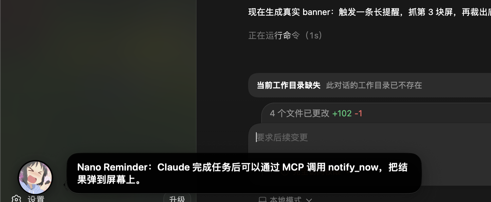

# Nano Reminder



A tiny macOS reminder shell for AI agents. It gives Claude Code and other local tools a stable way to pop a reminder window when work is done.

## What It Does

- Shows an immediate floating reminder window.
- Renders Markdown-ish inline text (`**strong**`, `*emphasis*`, and `` `code` ``) in an adaptive bubble.
- Supports optional choice buttons for lightweight ask-style prompts.
- Stores one-time scheduled reminders.
- Runs as a menu-bar resident app.
- Exposes a local MCP server so Claude Code can call `notify_now`.
- Keeps the app deliberately small: no AI logic, no recurring rules, no cron.

## Quick Start

```bash
git clone https://github.com/klrc/nano-reminder.git
cd nano-reminder
swift build --package-path NanoReminder
./bin/nano-reminder show --text "Hello from Nano Reminder"
```

Install the app bundle and optional Claude Code hook:

```bash
bin/rebuild-app.sh
bin/install-claude-hook.sh
```

Start the resident scheduler:

```bash
cd NanoReminder
swift run -- --resident
```

Schedule a one-time reminder:

```bash
./bin/nano-reminder add --at "2026-04-28T18:00:00+08:00" --text "下班打卡"
```

## Claude Code

This repository includes `.mcp.json` and `CLAUDE.md`.

When Claude Code runs from the repository root, it can discover the `nano-reminder` MCP server and use:

- `notify_now`: show a reminder immediately.
- `schedule_reminder`: create a future one-time reminder.

Example prompt:

```text
帮我跑一下构建，最后通知我。
```

Claude should finish the task and call `notify_now`.

For all Claude Code conversations, the optional user-level hooks mirror final replies and intercept ask/permission prompts into local Nano popups without depending on MCP:

```bash
bin/install-claude-hook.sh
bin/uninstall-claude-hook.sh
```

Final replies can end with a hidden mood marker such as `<!-- nano-mood:happy -->`. Supported moods are `calm`, `happy`, `grateful`, `confused`, `ask`, `panic`, and `shocked`. The hook removes the marker from the popup text and skips itself if the turn already sent a Nano notification. Ask/permission prompts use the dedicated `ask` Nano avatar.

## CLI

```bash
bin/nano-reminder show --text "现在喝水"
bin/nano-reminder show --text "**构建完成**，可以回来啦" --mood happy
bin/nano-reminder show --text "支持 `code`、*强调* 和 **重点**" --mood happy
bin/nano-reminder show --text "要继续吗？" --mood confused --choices "继续,取消"
bin/nano-reminder show --text "马上回来处理这个失败" --shake --mood panic
bin/nano-reminder add --at "2026-04-28T18:00:00+08:00" --text "下班打卡"
bin/nano-reminder list
bin/nano-reminder delete <id>
bin/nano-reminder clean
```

Data lives at:

```text
~/Library/Application Support/nano-reminder/tasks.json
```

## Roadmap

- [x] Adaptive bubble window sizing for different message lengths.
- [x] More Nano avatar expressions to represent different agent states.
- [x] Markdown-style `**keywords**` rendered with colorful RGB emphasis.
- [x] Optional choice prompts such as yes/no/custom answers, enabling an ask-style flow.
- [x] Optional window shake animation for moments when the agent is especially excited.

## License

MIT
